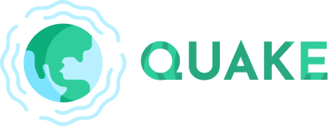

# Quake

A brief description of what this project does and who it's for


## Screenshots


##### Project Structure:

    Quake/
    ├── src/
    |   ├── assets/
    |   |   └── Logo.png
    |   ├── css/
    |   |   └── style.css
    |   └── js/
    |       ├── map.js
    |       └── script.js
    ├── config.js
    ├── index.html
    └── README.md


## Features

- Light/dark mode toggle
- Live previews
- Fullscreen mode
- Cross platform


## Run Locally

Clone the project

```bash
  git clone https://link-to-project
```

Go to the project directory

```bash
  cd my-project
```

Install dependencies

```bash
  npm install
```

Start the server

```bash
  npm run start
```


## Demo

Insert gif or link to demo


## Tech Stack

**Client:** HTML, CSS, JavaScript

**Server:** Mapbox GL JS, Mapbox Tileset api, USGS api


## Roadmap

- Additional browser support

- Add more integrations